# TinySearch

TinySearch is a tiny one-phase search engine. It is extremely easy to
use and works well with simple lists where the query may not match the
document text exactly.

This is a minimal search engine. You don't need to run separate, big
instances of search engine when your use case is a few hundreds or
thousands small documents.

## Example

Input documents:

```
"Goldilocks and the Three Bears"
"Fuzzy Wuzzy"
"The Bear Went Over The Mountain"
"We're Going on a Bear Hunt"
"Brown Bear, Brown Bear, What Do You See?"
```

Search query:

```
bear
```

Results (ordered by best match):

```
"Brown Bear, Brown Bear, What Do You See?"
"Goldilocks and the Three Bears"
"The Bear Went Over The Mountain"
"We're Going on a Bear Hunt"
```

## How to use

```python
from tinysearch.search import Search

docs = [
    "Goldilocks and the Three Bears",
    "Fuzzy Wuzzy",
    "The Bear Went Over The Mountain",
    "We're Going on a Bear Hunt",
    "Brown Bear, Brown Bear, What Do You See?",
]
query = "bear"

s = Search(docs, query)

# How many results?
print(s.results.count)

# What is the top result?
print(s.results.matches[0].doc)

# Print all matches. Best results are at the top.
for m in s.results.matches:
    print(m.doc)
```

## Pass your own analyzer

When `tinysearch.analyzer.SimpleEnglishAnalyzer` does not satisfy your
needs, you can write your own analyzer and pass it to the `Search`
object.

An analyzer inherits from `tinysearch.analyzer.base.Analyzer`. It only
need to implement `analyze` method. The `analyze` method accepts a string
representing the document on the input, and returns a list of strings
representing tokens (terms). Everything that you need to make it happen
can be implemented there. See the docstring of the `Analyzer` base class.

You can then pass your analyzer to `Search`:

```python
my_analyzer = MyOwnAnalyzer()

s = Search(docs, query, analyzer=my_analyzer)
print(s.results.count)
```

## Under the hood

When you pass documents to the `Search` object, each document is
tokenized and transformed for easier search. The same process is
applied to the query.

Then each document is scored using the TF-IDF algorithm to find the
best match, and matches are returned sorted to the user. The best match
is at the top.

## Performance

Performance is important since search engines typically respond to
user queries, so it should generate results in a few seconds at most.
More than that would appear as a significant delay.

The numbers below are dependent on the running machine, so they are
just indicative.

```mermaid
gantt
title Search time for different dataset sizes [s]
dateFormat X
axisFormat %s

section 100
0.1, terms=1 : 0, 0.1s
0.1, terms=2 : 0, 0.1s
0.1, terms=3 : 0, 0.1s

section 1000
0.6, terms=1 : 0, 0.6s
0.6, terms=2 : 0, 0.6s
0.5, terms=3 : 0, 0.5s

section 10000
5.2, terms=1 : 0, 5.2s
4.9, terms=2 : 0, 4.9s
4.9, terms=3 : 0, 4.9s

section 52478
26.8, terms=1 : 0, 26.8s
26.8, terms=2 : 0, 26.8s
26.8, terms=3 : 0, 26.8s
```



Datasets of around 1000 entries might generate reasonable search times,
which is the intended use case for TinySearch. Still, there is probably
room for improvement.

## License

See LICENSE.
